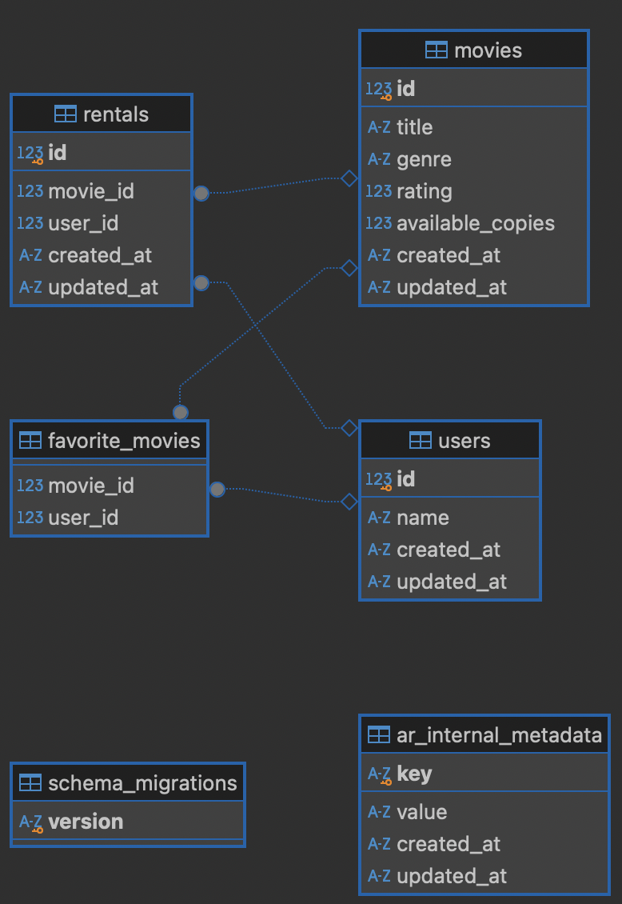

<h1 align="center" style="font-weight: bold;">Movie Rental API - Technical Challenge 💻</h1>

<p align="center">
 <a href="#tech">Technologies</a> • 
 <a href="#started">Getting Started</a> • 
  <a href="#routes">API Endpoints</a> •
</p>

<p align="center">
    <b>This project its for a challenge</b>
</p>

<h2 id="technologies">💻 Technologies</h2>

- list of all technologies you used
- Ruby
- Rails
- SQlite
- Docker
- docker-compose

<h2 id="started">🚀 Getting started</h2>

<h3>Prerequisites</h3>
- Docker
- docker-compose

<h3>Cloning</h3>

How to clone your project

```bash
git clone https://github.com/vitortcmiranda/movies-rental-challenge.git
```

<h3>Starting</h3>

How to start your project

```bash
docker-compose build
```

```bash
docker-compose up
```

```bash
docker-compose run web bundle install 
```

```bash
docker-compose run web rails db:migrate
```

```bash
docker-compose run web rails db:seed
```

Optionally: running tests
```bash
docker-compose run web rails test:integration
```


<h2 id="routes">📍 API Endpoints</h2>

List of available resources
​
| route               | description                                          
|----------------------|-----------------------------------------------------
| <kbd>GET /movies</kbd>     | This endpoint retrieves all the movies in the database and returns them in JSON format. Each movie object includes its `id`, `title`, `genre`, `rating`, and the number of `available_copies`.
| <kbd>GET /movies/recommendations?user_id=<user_id></kbd>     | This endpoint generates a list of movie recommendations for a given user. It uses a basic recommendation engine that takes the user's favorite movies as input and generates recommendations based on those favorites. The response is a JSON array of recommended movie objects.
| <kbd>GET /movies/user_rented_movies?user_id=<user_id></kbd>     | This endpoint retrieves all the movies that a user has currently rented. The user is identified by the `user_id` parameter in the URL. The response is a JSON array of movie objects that the user has rented.
| <kbd>GET /movies/<movie_id>/rent?user_id=<user_id></kbd>     | This endpoint allows a user to rent a movie. The user is identified by the `user_id` parameter and the movie by the `id` parameter in the URL. If successful, it reduces the number of `available_copies` of the movie by 1 and adds the movie to the user's `rented` movies. The response is a JSON object of the rented movie.


<h3 id="user-post-detail">POST /api/users</h3>


<h2 id="changes">📍 Request changes</h2>

Heres some tasks i think should be prioritize in order to not have bigger problems
​
| change               | description                                          
|----------------------|-----------------------------------------------------
| <kbd>1-Use docker in the application(Done)/kbd>     | Docker is essential to applications, to have they running fast can improve significantly quality, and delivery time.
| <kbd>2-Fit the resources inside rest/kbd>     | The rent resource was under GET wich its not right.
| <kbd>3-Integration tests</kbd>     | Create integration tests so the future changes can be made more safely.
| <kbd>4-Unit tests</kbd>     | Create unit tests for the same purpose, we cant break things in order to improve them.
| <kbd>5-Error Handling</kbd>     | Added error handling, transaction management, and refactored code for better readability and maintainability.
| <kbd>6-Transactional</kbd>     | The movie rent resource could be done in a transactional way to avoid a movie available copies being 0, being by Optimistic or Pessimistic lock.
| <kbd>7-Separation of concerns</kbd>     | I think the movies controller should be split into movie controller and user controller.
| <kbd>8-Swagger</kbd>     | The application root could be a page of swagger, i think swagger its good for apis to have the resources displayed and kind of documented.
| <kbd>9-Model validations</kbd>     | The models dont have validations

<h3>Database representation</h3>

